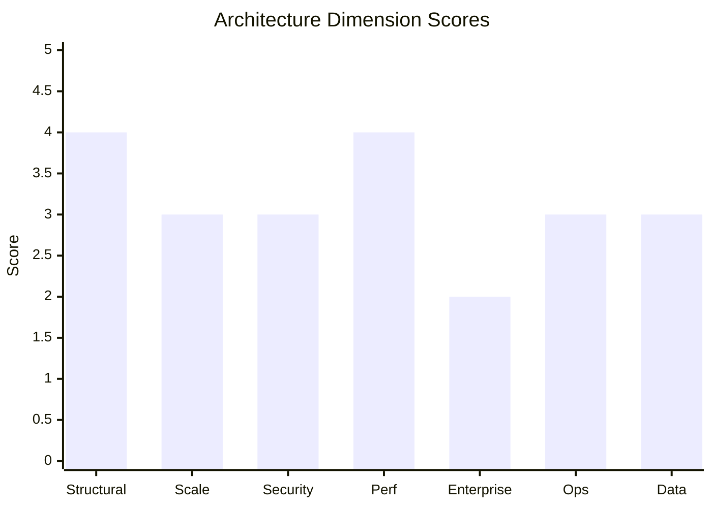

# Architecture Review Report: {{SYSTEM_NAME}}

<!--
╔══════════════════════════════════════════════════════════════════════════════╗
║  TEMPLATE COMPLIANCE REMINDER — DELETE THIS BLOCK BEFORE FINALIZING REPORT   ║
╠══════════════════════════════════════════════════════════════════════════════╣
║  • Scores: 1-5 scale ONLY (not 1-10)                                         ║
║  • Severities: [S1]-[S5] labels ONLY (not High/Medium/Low)                   ║
║  • Weights: 20%, 18%, 18%, 17%, 15%, 7%, 5%                                  ║
║  • Grades: A(90-100), B(80-89), C(70-79), D(60-69), F(<60)                   ║
║  • Formula: Overall% = (Σ score×weight) / 5 × 100                            ║
║  • Required sections: Meta, Executive Summary, Scorecard with Verification,  ║
║    Detailed Findings (7 dimensions), Cross-Cutting Concerns, Recommendations,║
║    Appendix (A-E)                                                            ║
║  • Before delivery: Complete Phase 4 Template Compliance Checklist in        ║
║    SKILL.md                                                                  ║
╚══════════════════════════════════════════════════════════════════════════════╝
-->

## Meta

| Field             | Value                                                                   |
| ----------------- | ----------------------------------------------------------------------- |
| **Review Date**   | {{DATE}}                                                                |
| **Review Mode**   | {{MODE — Codebase / Document / Hybrid}}                                 |
| **System Stage**  | {{STAGE — Greenfield / Early Development / Growth / Mature Production}} |
| **Overall Score** | **{{SCORE}}% — Grade {{GRADE}}**                                        |

**Reviewer Context Summary:**
{{Brief description of what was provided for review — files, documents, codebase scope,
user-provided context. 2-3 sentences.}}

---

## Executive Summary

### Overall Score: {{SCORE}}% — Grade {{GRADE}}

**Score Visualization** (choose one format):

Option A — Text-based bar chart:

```text
Structural Integrity  ████████░░  4.0/5
Scalability          ██████░░░░  3.0/5
Security             ██████░░░░  3.0/5
Performance          ████████░░  4.0/5
Enterprise Readiness ████░░░░░░  2.0/5
Operational Excel.   ██████░░░░  3.0/5
Data Architecture    ██████░░░░  3.0/5
```

Option B — Mermaid bar chart (if rendering supported):



(Delete the option not used. Replace placeholder values with actual scores.)

### Top 3 Strengths

1. {{Strength 1 — specific, citing evidence}}
2. {{Strength 2 — specific, citing evidence}}
3. {{Strength 3 — specific, citing evidence}}

### Top 3 Critical Risks

1. {{Risk 1 — severity, impact, which dimension}}
2. {{Risk 2 — severity, impact, which dimension}}
3. {{Risk 3 — severity, impact, which dimension}}

### Verdict

{{One-paragraph overall assessment. Is this architecture fit for its stated purpose? What
is the single most important thing to address? What is the overall trajectory — is this
architecture set up for success or heading toward trouble?}}

---

## Scorecard

| #   | Dimension              | Score   | Weight   | Weighted    | Key Finding          |
| --- | ---------------------- | ------- | -------- | ----------- | -------------------- |
| 1   | Structural Integrity   | {{X}}/5 | 20%      | {{X×0.20}}  | {{One-line summary}} |
| 2   | Scalability            | {{X}}/5 | 18%      | {{X×0.18}}  | {{One-line summary}} |
| 3   | Enterprise Readiness   | {{X}}/5 | 15%      | {{X×0.15}}  | {{One-line summary}} |
| 4   | Performance            | {{X}}/5 | 17%      | {{X×0.17}}  | {{One-line summary}} |
| 5   | Security               | {{X}}/5 | 18%      | {{X×0.18}}  | {{One-line summary}} |
| 6   | Operational Excellence | {{X}}/5 | 7%       | {{X×0.07}}  | {{One-line summary}} |
| 7   | Data Architecture      | {{X}}/5 | 5%       | {{X×0.05}}  | {{One-line summary}} |
|     | **Overall**            |         | **100%** | **{{SUM}}** |                      |

### Score Calculation Verification

**Arithmetic breakdown** (required for audit trail):

```text
Structural Integrity:   {{X}} × 0.20 = {{result}}
Scalability:           {{X}} × 0.18 = {{result}}
Security:              {{X}} × 0.18 = {{result}}
Performance:           {{X}} × 0.17 = {{result}}
Enterprise Readiness:  {{X}} × 0.15 = {{result}}
Operational Excellence: {{X}} × 0.07 = {{result}}
Data Architecture:     {{X}} × 0.05 = {{result}}
─────────────────────────────────────────────
Weighted Sum:                        {{SUM}}
Overall Percentage: {{SUM}} / 5 × 100 = {{SCORE}}%
Grade: {{GRADE}} (per {{RANGE}} range)
```

**Verification checklist:**

- [ ] Weights sum to 100%: 20 + 18 + 18 + 17 + 15 + 7 + 5 = 100 ✓
- [ ] Each weighted value = score × weight (3 decimal precision)
- [ ] Weighted sum = sum of all weighted values
- [ ] Percentage = weighted sum / 5 × 100
- [ ] Grade matches percentage per rubric: A(90-100), B(80-89), C(70-79), D(60-69), F(<60)

---

## Detailed Findings

### 1. Structural Integrity & Design Principles — Score: {{X}}/5

{{Brief dimension summary — 2-3 sentences on the overall state of this dimension.}}

#### Findings

**[S{{N}}] {{Finding Title}}**

- **Evidence:** {{Specific file/section/code location, or "Not addressed in design documents"}}
- **Impact:** {{What goes wrong, when, and how bad — be specific}}
- **Recommendation:** {{Specific, actionable fix with enough detail to implement}}

{{Repeat for each finding in this dimension, sorted by severity (S1 first, S5 last).}}

---

### 2. Scalability — Score: {{X}}/5

{{Brief dimension summary.}}

#### Findings

{{Same finding format as above.}}

---

### 3. Enterprise Readiness — Score: {{X}}/5

{{Brief dimension summary. Note which compliance frameworks were evaluated.}}

#### Findings

{{Same finding format as above.}}

---

### 4. Performance — Score: {{X}}/5

{{Brief dimension summary.}}

#### Findings

{{Same finding format as above.}}

---

### 5. Security — Score: {{X}}/5

{{Brief dimension summary.}}

#### Findings

{{Same finding format as above.}}

---

### 6. Operational Excellence — Score: {{X}}/5

{{Brief dimension summary.}}

#### Findings

{{Same finding format as above.}}

---

### 7. Data Architecture — Score: {{X}}/5

{{Brief dimension summary.}}

#### Findings

{{Same finding format as above.}}

---

## Cross-Cutting Concerns

### Multi-Dimension Issues

{{Issues that span multiple dimensions. Reference the relevant dimensions.}}

### Conflicting Design Decisions

{{Contradictions in the architecture. E.g., claiming strong consistency alongside horizontal
scalability without addressing the inherent tension.}}

### Architectural Coherence Assessment

{{Does this architecture have a unified vision? Or is it an accidental architecture assembled
from disconnected decisions?}}

### Requirements Alignment

{{Does this architecture solve the stated problem at the stated scale? Is it over-engineered
or under-engineered?}}

### Architecture Pattern Fitness

{{Is the current/proposed architecture pattern the right one? If not, what would be better
and why? Include migration path considerations if recommending a change.}}

{{Include a Mermaid diagram here if it helps illustrate the architectural concern — e.g.,
a dependency graph showing circular dependencies, a data flow showing a bottleneck, or a
proposed improved architecture.}}

### Systemic Risk

{{The single biggest risk. If one thing will sink this system, what is it?}}

---

## Recommendations — Prioritized

### Quick Wins (< 1 week, high impact)

| #   | Recommendation      | Addresses Finding     | Expected Impact   |
| --- | ------------------- | --------------------- | ----------------- |
| 1   | {{Specific action}} | {{Finding reference}} | {{What improves}} |
| 2   | {{Specific action}} | {{Finding reference}} | {{What improves}} |

### Medium-Term (1-4 weeks)

| #   | Recommendation      | Addresses Finding     | Expected Impact   |
| --- | ------------------- | --------------------- | ----------------- |
| 1   | {{Specific action}} | {{Finding reference}} | {{What improves}} |
| 2   | {{Specific action}} | {{Finding reference}} | {{What improves}} |

### Strategic (1-3 months, foundational)

| #   | Recommendation      | Addresses Finding     | Expected Impact   |
| --- | ------------------- | --------------------- | ----------------- |
| 1   | {{Specific action}} | {{Finding reference}} | {{What improves}} |
| 2   | {{Specific action}} | {{Finding reference}} | {{What improves}} |

---

## Appendix

### A. Files / Documents Reviewed

{{List all files, documents, and sources examined during the review.}}

### B. Assumptions Made

{{List assumptions that were made where information was incomplete.}}

### C. Out-of-Scope Items

{{Items explicitly excluded from this review and why.}}

### D. Sub-Criteria Marked Not Applicable

{{List sub-criteria skipped with justification for each.}}

### E. Methodology

This review was conducted using the Architecture Reviewer framework, evaluating 7 dimensions
with weighted scoring. Findings are classified by severity (S1-Critical through
S5-Informational). The overall score is computed as the weighted average of dimension scores,
normalized to a 100-point scale.

Dimension weights: Structural Integrity (20%), Scalability (18%), Security (18%),
Performance (17%), Enterprise Readiness (15%), Operational Excellence (7%),
Data Architecture (5%).

{{Note any weight adjustments made for this specific review and why.}}
