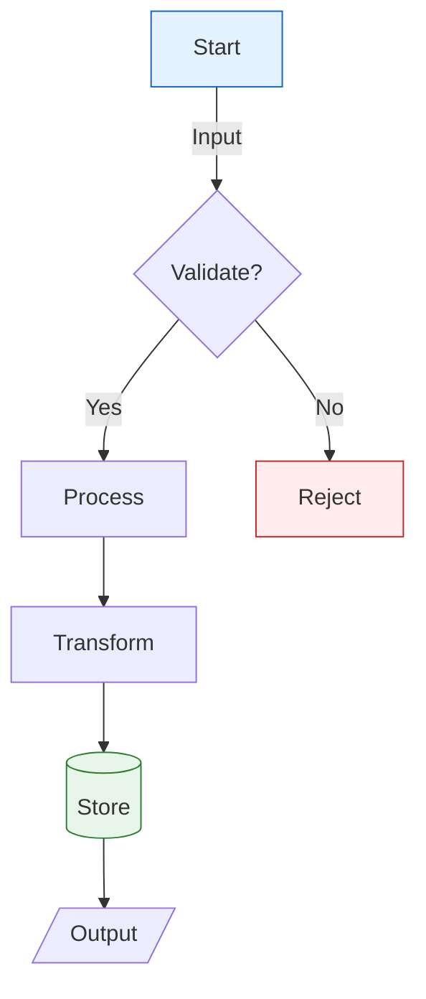
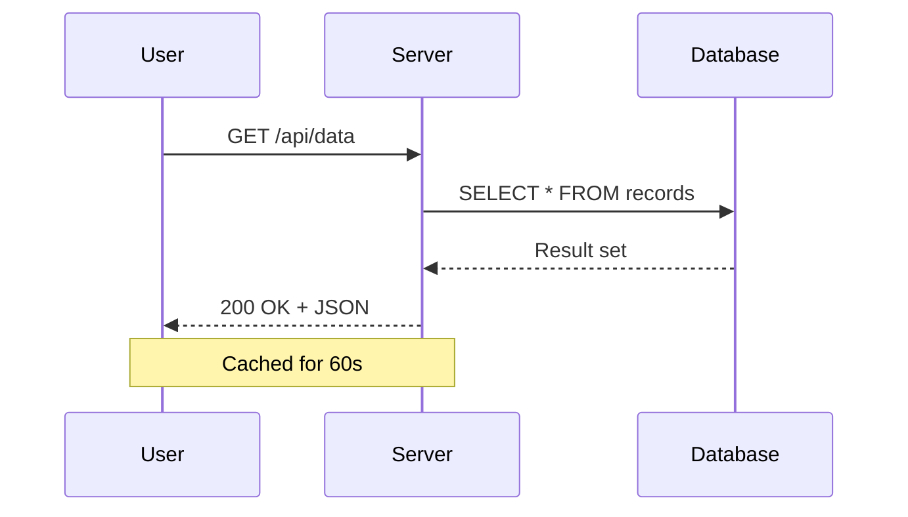
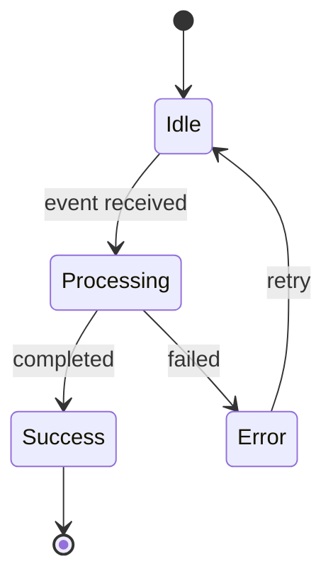
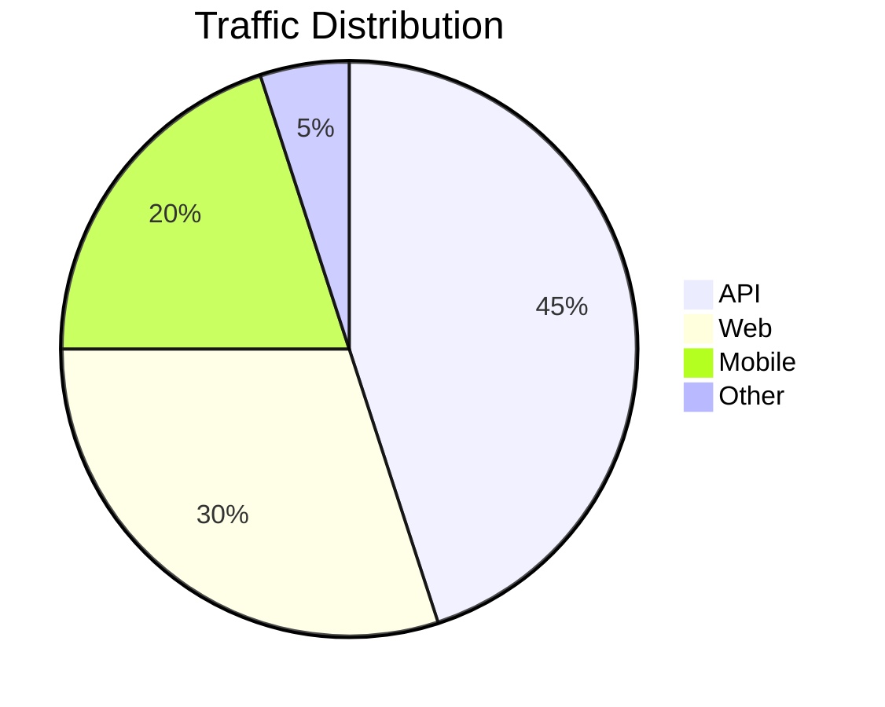

# md-to-pdf Feature Test Document

This document exercises every rendering feature supported by the `md-to-pdf` skill.
A successful conversion produces a multi-page PDF with all elements rendered correctly.

---

## 1. Mermaid Diagrams

### 1.1 Flowchart



### 1.2 Sequence Diagram



### 1.3 State Diagram



### 1.4 Pie Chart



## 2. LaTeX Mathematics

### 2.1 Inline Math

The quadratic formula gives $x = \frac{-b \pm \sqrt{b^2 - 4ac}}{2a}$ for any $ax^2 + bx + c = 0$.

Einstein's famous equation: $E = mc^2$. Euler's identity: $e^{i\pi} + 1 = 0$.

### 2.2 Display Math

The Gaussian integral:

$$\int_{-\infty}^{\infty} e^{-x^2} \, dx = \sqrt{\pi}$$

Maxwell's equations in differential form:

$$\nabla \cdot \mathbf{E} = \frac{\rho}{\epsilon_0}$$

$$\nabla \times \mathbf{B} = \mu_0 \mathbf{J} + \mu_0 \epsilon_0 \frac{\partial \mathbf{E}}{\partial t}$$

A matrix equation:

$$\begin{pmatrix} a & b \\ c & d \end{pmatrix} \begin{pmatrix} x \\ y \end{pmatrix} = \begin{pmatrix} ax + by \\ cx + dy \end{pmatrix}$$

The Fourier transform:

$$\hat{f}(\xi) = \int_{-\infty}^{\infty} f(x) \, e^{-2\pi i x \xi} \, dx$$

## 3. Tables

### 3.1 Standard Table

| Feature | Status       | Notes              |
| ------- | ------------ | ------------------ |
| Mermaid | ✅ Supported | All diagram types  |
| LaTeX   | ✅ Supported | Inline and display |
| Tables  | ✅ Supported | GFM pipe tables    |
| Code    | ✅ Supported | Syntax highlighted |

### 3.2 Numeric Table

| Metric       |   Q1 |   Q2 |   Q3 |   Q4 | Annual |
| ------------ | ---: | ---: | ---: | ---: | -----: |
| Revenue ($M) | 12.4 | 15.1 | 18.7 | 22.3 |   68.5 |
| Users (K)    |  340 |  412 |  520 |  681 |    681 |
| Latency (ms) |   45 |   38 |   32 |   28 |     36 |

## 4. Code Blocks

### 4.1 Python

```python
from typing import TypeVar, Generic
from dataclasses import dataclass

T = TypeVar("T")

@dataclass
class Result(Generic[T]):
    """Rust-inspired Result type."""
    value: T | None = None
    error: str | None = None

    @property
    def is_ok(self) -> bool:
        return self.error is None

    def unwrap(self) -> T:
        if self.error:
            raise ValueError(self.error)
        return self.value  # type: ignore
```

### 4.2 Go

```go
package main

import (
    "fmt"
    "sync"
)

func fanOut(input <-chan int, workers int) []<-chan int {
    channels := make([]<-chan int, workers)
    for i := 0; i < workers; i++ {
        ch := make(chan int)
        channels[i] = ch
        go func(out chan<- int) {
            defer close(out)
            for v := range input {
                out <- v * v
            }
        }(ch)
    }
    return channels
}
```

### 4.3 SQL

```sql
WITH ranked AS (
    SELECT
        user_id,
        event_type,
        created_at,
        ROW_NUMBER() OVER (PARTITION BY user_id ORDER BY created_at DESC) AS rn
    FROM events
    WHERE created_at > CURRENT_DATE - INTERVAL '7 days'
)
SELECT user_id, event_type, created_at
FROM ranked
WHERE rn = 1;
```

## 5. Text Formatting

**Bold text**, _italic text_, **_bold and italic_**, ~~strikethrough~~, and `inline code`.

### 5.1 Blockquote

> "The purpose of abstraction is not to be vague, but to create a new semantic
> level in which one can be absolutely precise."
>
> — Edsger W. Dijkstra

### 5.2 Nested Lists

1. First level ordered
   - Second level unordered
   - Another item
     1. Third level ordered
     2. Another ordered
2. Back to first level
   - Mixed nesting works

### 5.3 Definition List

Term One
: Definition of the first term with some explanation.

Term Two
: Definition of the second term. Can include `code` and **formatting**.

### 5.4 Footnotes

This claim requires a citation[^1]. Another reference here[^2].

[^1]: First footnote with supporting evidence.

[^2]: Second footnote providing additional context.

## 6. Horizontal Rule

Content above the rule.

---

Content below the rule.

## 7. Links and Images

Visit [example.com](https://example.com) for more information.

## 8. Conclusion

If all sections above render correctly in the output PDF — diagrams as vector SVG,
math as properly typeset equations, tables with alternating row colors, and code with
syntax highlighting — the skill is functioning as designed.

Inline math verification: The area of a circle is $A = \pi r^2$ and its circumference is $C = 2\pi r$.
