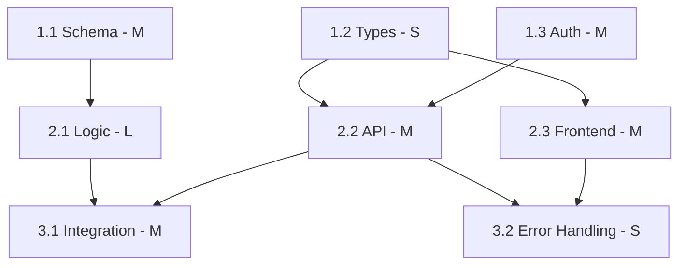

# Dependency Mapping

Constructing dependency graphs for task sequences, identifying the critical path,
and maximizing parallelization.

---

## Dependency Types

| Type | Symbol | Meaning                              | Example                             |
| ---- | ------ | ------------------------------------ | ----------------------------------- |
| Hard | →      | B cannot start until A completes     | DB table → queries                  |
| Soft | ⇢      | B benefits from A but can use a stub | API endpoint ⇢ frontend integration |
| None | ∥      | Independent, can run in parallel     | Endpoint A ∥ Endpoint B             |

### Identifying Hard Dependencies

A task has a hard dependency when:

- It needs the output artifact of another task (table, interface, module)
- It modifies the same file (only one person should edit a file at a time)
- It requires a specific system state (auth must work before authorization)

### Identifying Soft Dependencies

A task has a soft dependency when:

- It could use a mock or stub instead of the real implementation
- It could use a simplified version and upgrade later
- The integration point has a defined contract (interface, API spec)

---

## Critical Path

The critical path is the longest chain of dependent tasks. It determines the
minimum duration of the entire feature.

### Calculation

1. List all dependency chains from start to end
2. Sum the effort estimates for each chain
3. The longest chain is the critical path

```text
Example:
Chain 1: Task 1.1 (M) → Task 2.1 (L) → Task 3.1 (M) = M+L+M
Chain 2: Task 1.2 (S) → Task 2.2 (M) → Task 3.1 (M) = S+M+M
Chain 3: Task 1.1 (M) → Task 2.3 (S) → Task 3.1 (M) = M+S+M

Critical path: Chain 1 (longest)
```

### Optimizing the Critical Path

1. **Break down the largest task on the critical path** — Can it be parallelized?
2. **Move work off the critical path** — Can tasks be resequenced?
3. **Stub dependencies** — Convert hard dependencies to soft by defining interfaces early
4. **Start the critical path first** — Don't delay critical path tasks

---

## Parallelization

### Maximum Parallelism

Count the maximum number of tasks that can execute simultaneously at any point.

```text
Phase 1: [1.1] [1.2] [1.3]        → 3 parallel
Phase 2: [2.1→1.1] [2.2→1.2]      → 2 parallel
Phase 3: [3.1→2.1,2.2]            → 1 (convergence point)
```

### Parallelization Opportunities

| Opportunity            | Description                                      |
| ---------------------- | ------------------------------------------------ |
| Independent features   | Two features with no shared state                |
| Frontend + Backend     | Same feature, both work against defined contract |
| Data + Logic           | Schema design ∥ algorithm prototyping            |
| Tests + Implementation | Test structure ∥ implementation (TDD)            |
| Documentation + Code   | If API contract is defined                       |

---

## Visualization

### Simple Text Format

```text
1.1 Database schema [M] ────────────────┐
1.2 API types/interfaces [S] ─────┐     │
1.3 Auth middleware [M] ─────┐    │     │
                             │    │     │
2.1 Business logic [L] ──────┼────┼─────┤ (depends on 1.1)
2.2 API endpoints [M] ───────┼────┘     │ (depends on 1.2)
2.3 Frontend components [M] ─┘          │ (depends on 1.2)
                                        │
3.1 Integration testing [M] ────────────┘ (depends on 2.1, 2.2)
3.2 Error handling [S] ────────────────── (depends on 2.2, 2.3)
```

### Mermaid Diagram



---

## Dependency Anti-Patterns

| Anti-Pattern                     | Problem                                              | Fix                                                     |
| -------------------------------- | ---------------------------------------------------- | ------------------------------------------------------- |
| Everything depends on everything | No parallelism, single-threaded execution            | Find and break unnecessary dependencies                 |
| Hidden dependency                | Task fails because unstated prerequisite wasn't done | Make all dependencies explicit                          |
| Circular dependency              | A→B→C→A, can't start anywhere                        | Break the cycle with an interface                       |
| Over-serialization               | Tasks marked dependent when they could be parallel   | Challenge each dependency: "Could B start with a stub?" |
